# 再也不用真人出镜了!推荐16款AI虚拟形象生成的神器!

做短视频、搞社交媒体营销,最头疼的就是不想露脸,但又需要人物出镜来提升互动率。AI虚拟形象生成器彻底解决了这个痛点,让你几秒钟就能创建一个超逼真的数字人,还能让它说话、唱歌、做表情。这份清单整理了16款实测好用的AI虚拟形象工具,覆盖从静态头像到动态视频的全流程,帮你快速搭建无需真人出镜的内容体系,降低创作门槛的同时提升产出效率。

## **[APOB.AI](https://apob.ai)**

专为无脸创作者打造的AI虚拟网红平台,一站式完成形象生成、视频制作和语音合成。

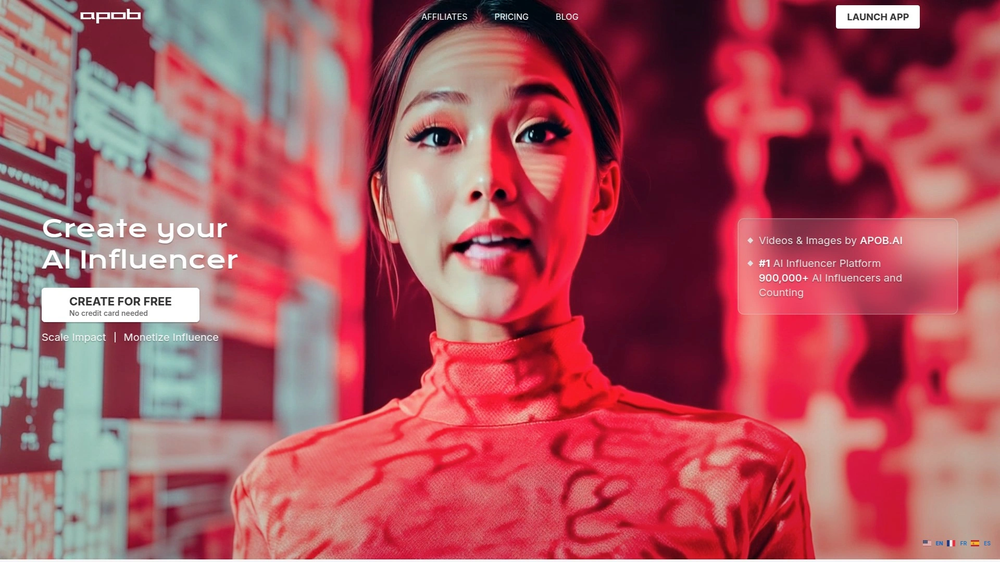

APOB.AI最大的亮点是它的AI虚拟网红生成器,你可以自定义性别、年龄、国籍、眼睛颜色、发型等所有关键属性,直接生成一个完全原创的数字人形象。平台支持两种创建方式:上传一张参考照片让AI学习风格,或者从零开始用生成器完全定制。生成形象后,你能通过"Build Your Own Mode"调整风格、外观、环境和天气,让每个画面都有独特的视觉效果。

**视频和语音功能**让这个平台特别实用。Image to Video功能能把静态图片转成动态视频,Talking Avatar让你的虚拟形象说任何你想说的话。新推出的Camera Movement和Clothes Editing功能让视频更生动自然,这对吸引粉丝和订阅者至关重要。Expert模式还支持自定义提示词和负面提示词,给你更精细的控制权。

**适用场景**:非常适合想做YouTube无脸频道、Instagram虚拟网红、TikTok内容创作的用户。平台每天提供80个免费积分,新手可以先体验所有功能再决定是否升级。已经有超过90万AI虚拟形象在平台上创建,社区活跃度很高。

## **[HeyGen](https://www.heygen.com)**

强大的AI视频生成平台,拥有1000+可用虚拟形象和多语言支持。

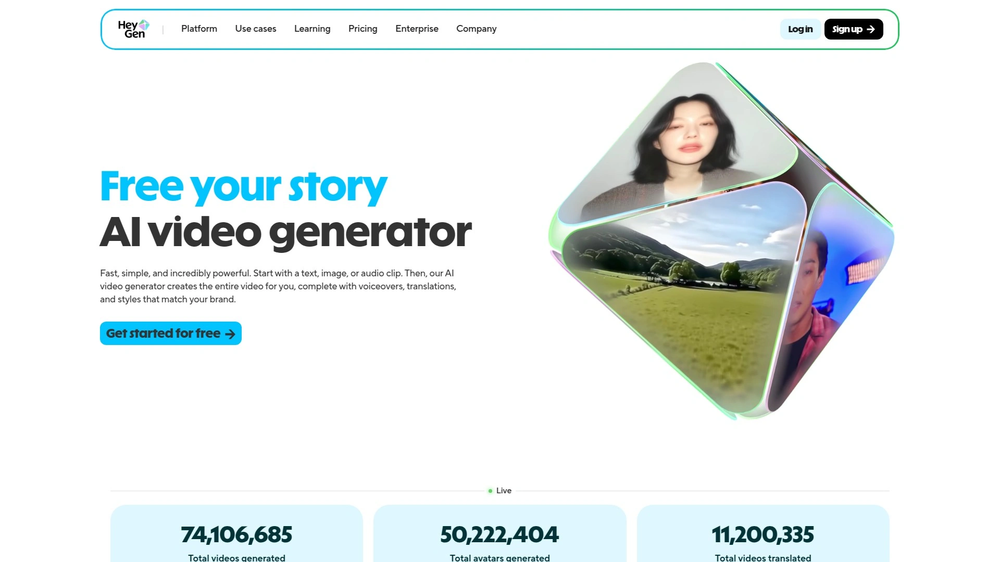

HeyGen的核心优势在于它庞大的虚拟形象库和AI文本转语音同步技术。平台能把静态图片转成会动的虚拟形象,还有服装生成器让你自定义虚拟形象的穿着。模板库涵盖各种场景,你也可以创建自定义场景来匹配品牌调性。

免费版本就能生成虚拟形象和1分钟视频,付费套餐从每月24美元起。特别适合需要快速产出培训视频、产品介绍或社交媒体内容的团队。界面友好,即使没有视频制作经验也能轻松上手。

## **[Synthesia](https://www.synthesia.io)**

专业级AI视频创作平台,支持120+语言和自定义虚拟形象。

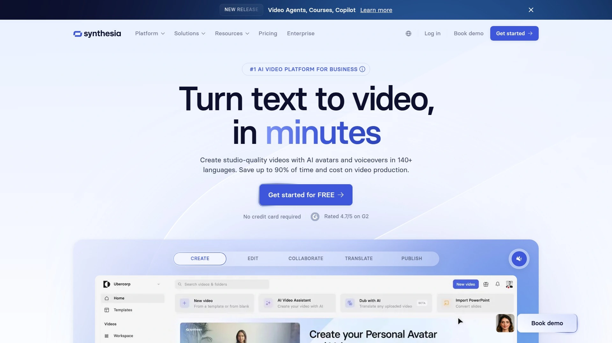

Synthesia是企业级用户的首选,它提供从预设虚拟形象到完全定制的数字克隆服务。你可以上传自己的视频片段来创建个性化虚拟形象,平台的AI脚本助手还能帮你快速生成视频脚本。支持自定义虚拟形象年龄和服装,让数字人更贴合你的业务需求。

Synthesia Studio功能强大,集成了完整的视频创作工作流。提供3分钟免费试用,年付套餐从每月25美元起。多语言支持让它特别适合需要制作国际化内容的企业。

## **[D-ID](https://www.d-id.com)**

用一张照片就能创建会说话的AI虚拟形象,支持100+语言。

D-ID的Creative Reality Studio让创建AI虚拟形象变得超简单:上传一张肖像照,选择语言和声音,输入脚本或音频,平台就会生成一个逼真的说话虚拟形象视频。不需要任何技术知识或制作工具,几分钟就能完成。

平台提供多种虚拟形象类型:Standard Avatars从照片和插图创建,Express Avatars用1分钟视频生成数字克隆,Premium+ Avatars用3分钟视频创建高保真虚拟形象。所有类型都包含先进的语音克隆和唇形同步技术。支持100+语言和方言,非常适合全球化内容制作。

## **[Elai.io](https://elai.io)**

最先进直观的AI视频生成器,70+虚拟形象支持多种语言。

Elai.io把复杂的视频制作流程简化到极致,文本转视频功能会自动添加字幕。你可以用自拍照创建个性化虚拟形象,增加内容的独特性。平台特别适合制作培训和教育内容,还能对接电子学习平台。

虚拟形象库涵盖250+选项,虽然动态表现不如部分竞品,但对初学者非常友好。免费试用后付费套餐从每月23美元起,性价比突出。文章转视频和自动转录功能能大幅提升内容产出速度。

## **[Hour One](https://hourone.ai)**

专注超写实虚拟形象的AI视频平台,100+顶级形象可选。

Hour One的虚拟形象以逼真度著称,特别适合需要人性化触感的视频内容。平台提供影棚级视频模板和先进的文本转语音技术。虚拟形象数量虽然不如Elai多,但质量更高,每个形象都经过精心设计。

从静态图片创建会说话的虚拟形象只需几步,支持25+语言和自动翻译。免费套餐包含基础虚拟形象和AI脚本生成,专业套餐从每月30美元起,企业方案可定制。

## **[Creatify AI](https://creatify.ai)**

为广告和营销视频设计的AI人物生成器,1000+虚拟形象库。

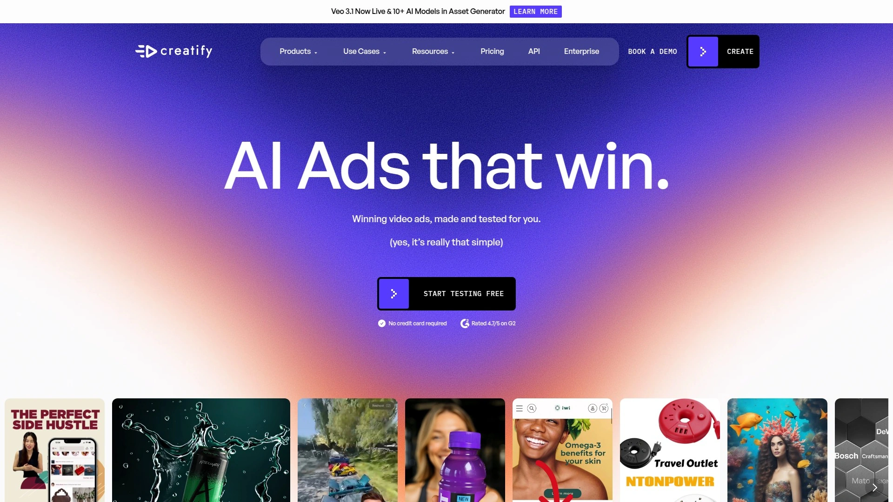

Creatify的AI虚拟形象生成器能快速创建逼真的AI人物用于视频制作。平台特别擅长生成适合广告的虚拟形象,支持多种风格和场景。免费虚拟形象视频生成器降低了试用门槛,你可以先测试效果再决定升级。

适合电商品牌和营销团队快速产出产品视频和广告素材。虚拟形象表现力强,能有效提升视频互动率和转化率。

## **[The Influencer AI](https://www.theinfluencer.ai)**

领先的AI虚拟网红生成器,专注个性化视频广告。

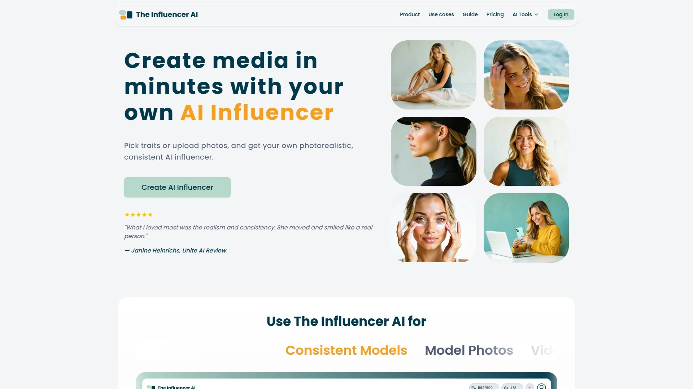

The Influencer AI能把文本转成个性化视频,虚拟形象支持多语言唇形同步。平台与CRM系统集成,方便大规模定制视频内容。AI脚本生成功能让你快速创建广告文案。

特别适合个性化邮件营销和广告投放场景,能批量生成大量视频。起步价约每月25美元,企业套餐价格面议。虚拟形象种类相对有限,风格偏商务而非UGC。

## **[Tagshop AI](https://tagshop.ai)**

终极AI UGC视频生成器,100+超逼真虚拟形象。

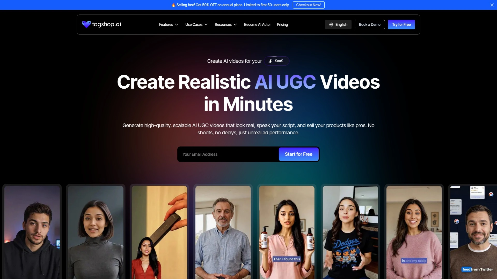

Tagshop AI专为电商品牌设计,能把产品链接直接转成AI虚拟网红视频。平台的虚拟形象看起来像真实社交媒体明星,配有自然的声音和动作。脚本听起来像顾客的好评,还会自动配上流行音乐。

视频生成速度快到惊人,几分钟就能完成。可以直接上传到Meta或TikTok广告投放平台,整个流程无缝衔接。基础套餐每月29美元起包含20个视频,有免费试用。最适合需要快速产出UGC风格视频用于广告或社交媒体的品牌。

## **[Jogg AI](https://www.jogg.ai)**

用文本提示生成虚拟数字人,支持200+语言克隆。

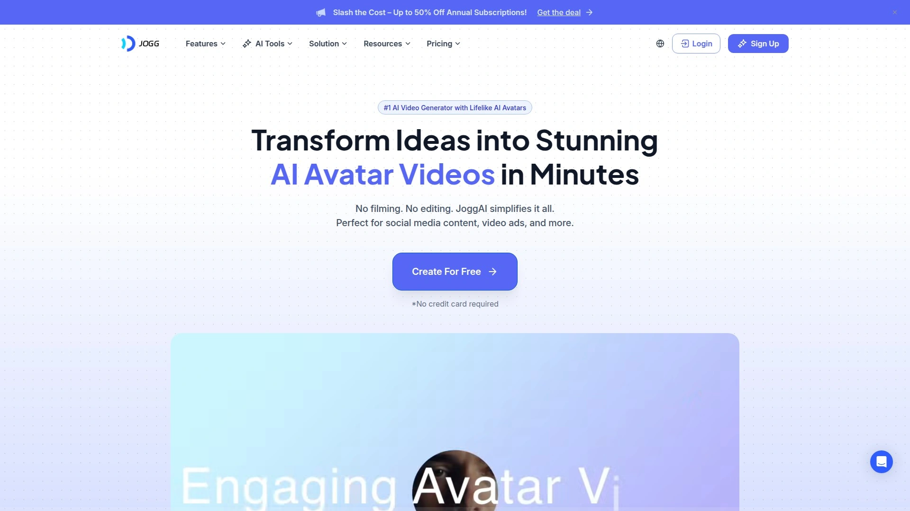

Jogg AI的数字人生成器能根据你的文字描述创建高度定制化的角色:发型、服装、背景、甚至情绪都能控制。你还能训练AI让角色外观保持一致,然后用不同服装、配饰和背景来适配各种场景。

个人数字孪生功能特别实用,只需上传一张照片或短视频,Jogg AI就能复制你的面部特征和表情,创建一个完全像你的数字分身。这个分身能说200+种语言,非常适合制作多语言内容。

## **[Generated Photos Human Generator](https://generated.photos/human-generator)**

AI人类生成器,实时创建超写实全身照。

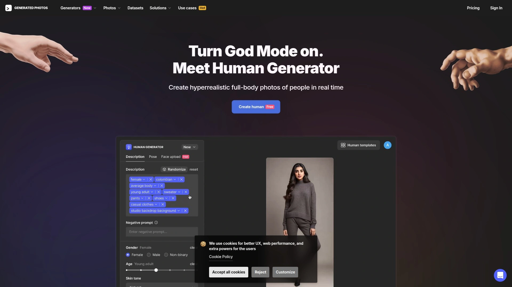

Generated Photos用先进的AI算法生成的人类形象几乎无法和真人区分。最大的优势是能生成不同种族、年龄和体型的全身照,姿势从专业到休闲都有。还支持把你的脸放到生成的身体上,实现即时变换。

不同服装选项让你随心所欲地打扮模特。非商业用途完全免费,商业使用需联系官方。即将推出生成变体、动画和历史记录等功能。

## **[Colossyan](https://www.colossyan.com)**

专业AI虚拟形象用于培训视频,150+多样化形象和声音。

Colossyan专注商业培训场景,能把文本、PDF和PPT转成互动培训视频。提供高清虚拟形象,支持80+语言的本地化定制。独特的场景化培训功能让虚拟形象之间对话,模拟真实培训场景。

视频可以轻松添加测验和互动元素,支持SCORM等多种格式导出和分享。企业级解决方案提供更强的扩展性。免费试用后套餐从每月27美元起,适合HR和培训部门。

## **[Remini](https://remini.ai)**

AI照片增强器,也能生成LinkedIn头像和虚拟形象。

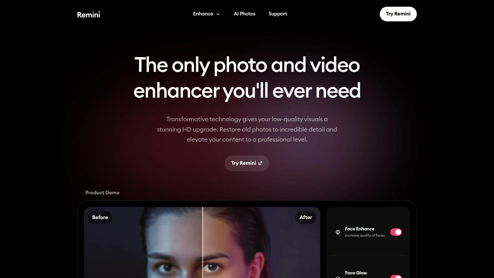

Remini最初以照片修复闻名,现在它的虚拟形象生成功能同样出色。LinkedIn头像功能让你上传自拍就能得到专业级头像照。婴儿照片生成器很有意思,虽然不一定像你小时候,但生成的婴儿照很可爱。

视频功能能展示你从童年到老年的脸部变化。用户体验流畅,采用类似Tinder的滑动选择界面。提供7天免费试用,功能有限但足以了解平台能力。生成速度稍慢,有时需要一分钟以上。

## **[Fotor AI Portrait Generator](https://www.fotor.com/features/ai-portrait-generator)**

免费在线AI肖像生成器,从照片或文本创建专业肖像。

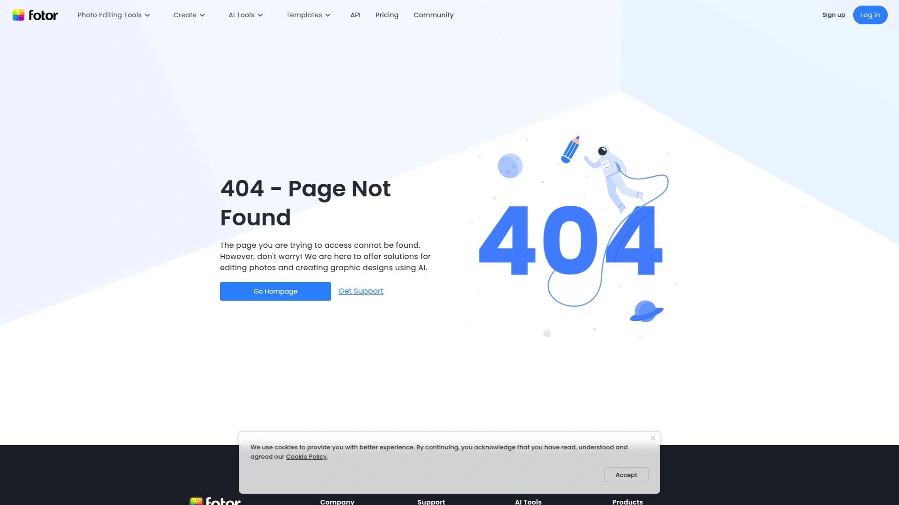

Fotor不只是生成商务肖像,还提供多种奇幻肖像风格,让你的照片瞬间变成中世纪传说或童话角色。动漫风格特别受欢迎,上传自拍选择预设动漫样式就能看到自己的动漫版。

平台还提供非二元性别风格,这是很多工具没有的。你可以自豪地展示自己的身份认同,生成吸睛的AI非二元头像用作社交媒体头像。文本转肖像功能同样强大,只需提供性别、年龄、肤色、发型或服装等简单提示词,Fotor就能自动生成高质量专业肖像。

## **[Runway ML](https://runwayml.com)**

创意工具套件,能让AI虚拟形象动起来。

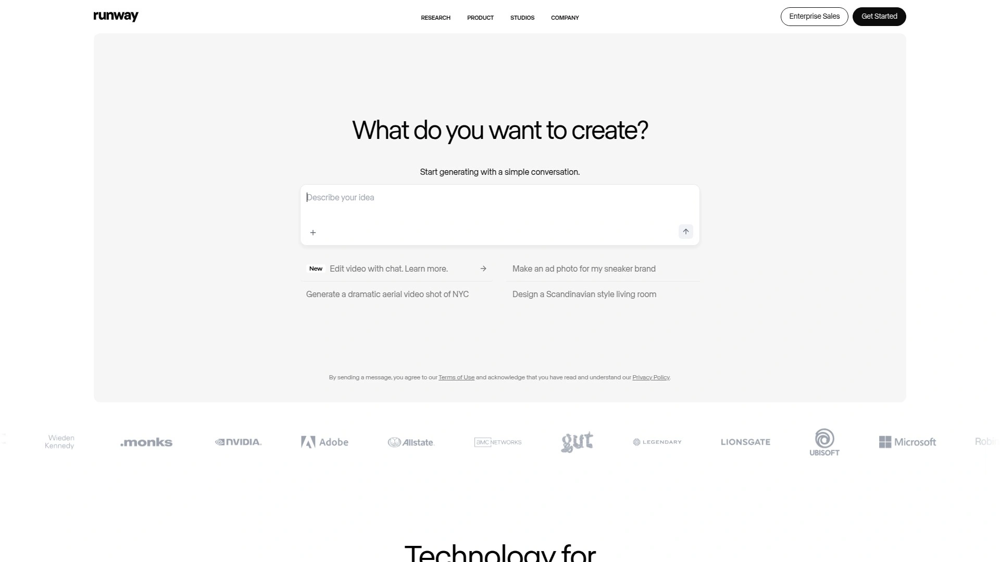

Runway ML是视频编辑和AI动画的综合平台。Gen-3 Alpha工具能把静态AI虚拟形象图片转成动态视频,关键是要在提示词中加入"Static camera. The camera is still."来避免不必要的镜头移动,还要加上"speaking"让画面更生动。

适合已经有虚拟形象图片,想让它们动起来的创作者。配合Leonardo AI或DALL-E生成的静态形象使用效果更佳。免费版有一定限制,但足够测试基础功能。

## **[Lensa AI](https://lensa.app)**

Magic Avatars功能把自拍变成艺术风格数字肖像。

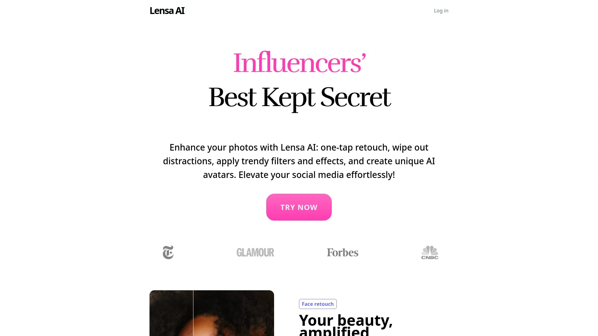

Lensa AI的Magic Avatars是它的招牌功能,上传10-20张自拍照,应用会把它们转成动漫、奇幻、科幻、波普艺术、神秘和宇宙等多种风格的艺术肖像。生成的虚拟形象捕捉你的特征并以艺术方式呈现,非常适合用作社交媒体头像或数字艺术作品。

应用本身也是强大的照片编辑器,提供AI增强功能来优化面部特征、眼睛、光线和肤色。提供7天免费试用,之后可以订阅获得更多编辑功能、积分折扣和独家素材包。

## **[Ready Player Me](https://readyplayer.me)**

跨平台3D虚拟形象SDK,适合游戏和虚拟世界集成。

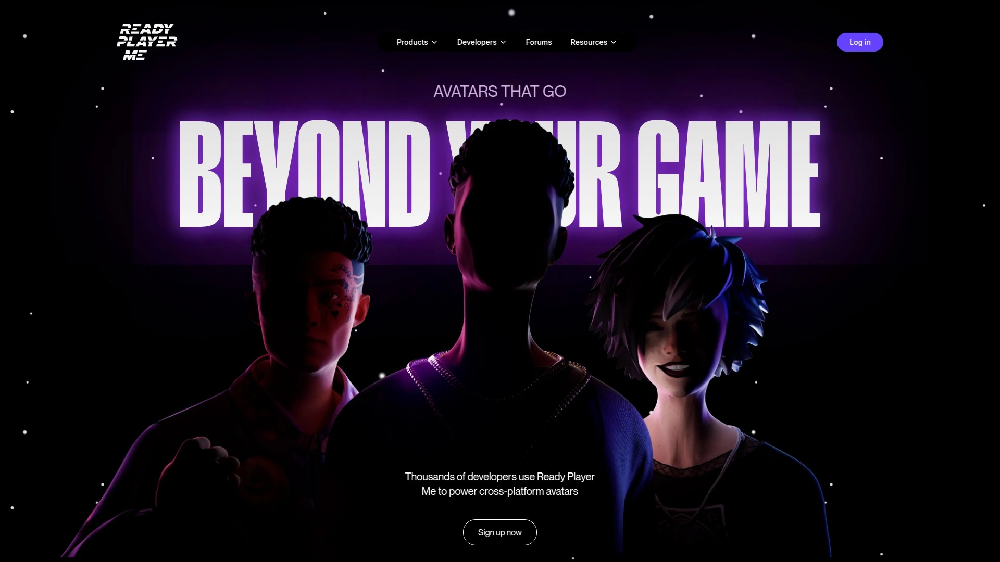

Ready Player Me是开发者友好的虚拟形象创建系统,提供Unity和WebGL支持。它不是简单的虚拟形象生成器,而是一个完整的SDK,让你的用户能在游戏或应用中创建和使用自己的3D虚拟形象。

支持Windows、Mac、Linux、Android和iOS多平台。虚拟形象可以在多个游戏和虚拟世界中使用,实现真正的跨平台身份。对于开发虚拟世界、元宇宙应用或多人游戏的团队来说是理想选择。

## 常见问题

**新手应该从哪个工具开始?**

如果你想快速创建无脸内容并变现,[APOB.AI](https://apob.ai)的一站式流程最省心,每天80免费积分够你充分测试。如果只需要简单的说话虚拟形象,D-ID或HeyGen的免费试用就能搞定基础需求。预算有限的话Elai.io和Tagshop AI性价比突出。

**这些虚拟形象能用于商业用途吗?**

大部分平台生成的虚拟形象都支持商业使用,但要注意各平台的具体条款。APOB.AI、HeyGen、Synthesia等明确支持商业内容创作。Generated Photos的免费版仅限非商业用途,商业使用需要付费。使用前最好确认一下授权范围。

**虚拟形象看起来真实吗?**

技术已经发展到相当成熟的阶段,D-ID、Synthesia和Hour One生成的虚拟形象逼真度很高,近距离也难以分辨。APOB.AI的用户反馈显示生成效果非常接近真人。不过动画的自然度还是有差异,Express Avatars和Premium+级别的虚拟形象在动作和表情上更流畅,适合长视频内容。

## 结语

无论你是想做YouTube无脸频道、Instagram虚拟网红,还是为企业制作培训视频,合适的AI虚拟形象生成器能让你事半功倍。这16款工具各有千秋,从快速生成到深度定制,从静态肖像到动态视频,总有一款符合你的创作需求。如果你想要一个功能全面、上手简单的平台来快速启动无脸创作,[APOB.AI](https://apob.ai)的90万+用户基础和完整的图片-视频-语音工作流能帮你从零开始搭建虚拟形象体系,把更多精力放在内容策略和受众增长上。选对工具只是起点,持续产出高质量内容才是打造成功虚拟网红的关键。
